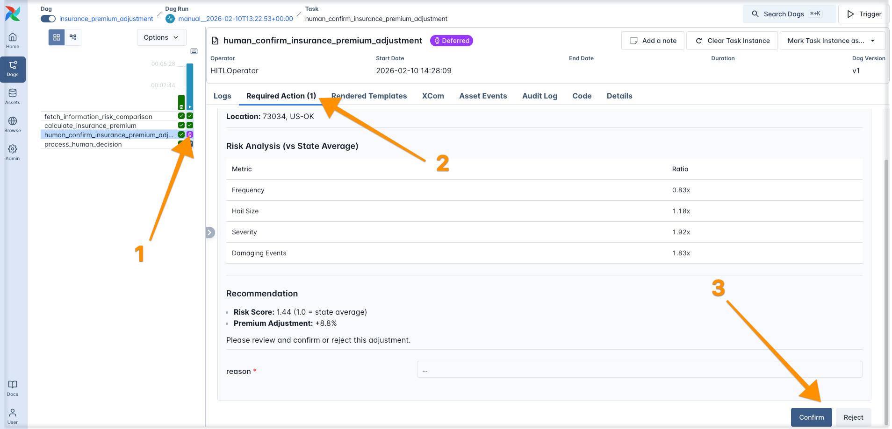

# Astronomer + Wherobots Workshop 

This is the companion repository for the [Astronomer + Wherobots Workshop](https://wherobots.com/event/building-production-geospatial-pipelines-with-airflow-and-wherobots/).

# How to use this repository

## Setup on Astro

0. Sign up for a free Astronomer trial account at [https://www.astronomer.io/](https://cloud.astronomer.io/?utm_source=wherobots&utm_medium=webinar&utm_campaign=26-02-wherobots-workshop).


## Setup on Wherobots

0. Sign up for a Wherobots account at [https://wherobots.com/](https://login.cloud.wherobots.com/). Note that to run the full pipeline you will need to upgrade to the Pro plan.


## Connect Astro to Wherobots


# Exercises

### Exercise 1: Run and modify your first Dag!

Run and modify your first Dag! For this exercise, navigate to the `dags/presentation_dags` directory and open the `exercise_1_dag.py` file. 


You can make changes directly in the Astro IDE and sync them to your Test Deployment using the `Sync to Test` button. 

Try to add an additional task that squares the favorite number and prints it to the logs.


Then run the Dag in the Airflow UI!


A successful run will look like this:


### Exercise 2: Test the connection to Wherobots

Run the `exercise_2_dag` to test the connection to Wherobots using the WherobotsSQLHook, WherobotsSqlOperator, and WherobotsRunOperator.


### Exercise 3: Run the use case pipeline!

Now you are ready to run the end-to-end geospatial pipeline! You can do so by starting the `start_pipeline` Dag and providing a US postcode (it works best if it is a location that got hail in the last 3 months).


All Dags should run successfully with the `insurance_premium_adjustment` Dag staying in running state: it is waiting for input from you to confirm the insurance premium adjustment! 

Navigate to the `insurance_premium_adjustment` Dag in the Airflow UI and click on the task in purple, and then on the `Required Actions` tab, it displays a comparision between the hail risk of the state and county containing the zip code, alongside a recommendation for the insurance premium adjustment.

You can either confirm or reject the recommendation and give your reasoning for the decision.



### Optional: Visualize the results!

Once the full pipeline has run, you can create a visualization of the results using the `visualization` Dag, the visualization will be saved to the S3 bucket you set as your `S3_URI`. 

Download the html and open it in your browser to explore the visualization.


# Alternative setup: using the Astro CLI

If you don't want to start an Astro trial you can use the local Astro CLI to run the pipeline.

1. Install the Astro CLI by following the [instructions here](https://www.astronomer.io/docs/astro/cli/install-cli).

2. Clone this repository and navigate to the root directory.

3. Copy the `.env.example` file to `.env` and fill in your values (Wherobots API Key and S3 URI).

4. Run the following command to start the Astro CLI:

```bash
astro dev start
```

5. Navigate to `http://localhost:8080` to access the Airflow UI and follow the rest of the instructions above. 

# Resources

- [Wherobots Airflow provider Documentation](https://docs.wherobots.com/develop/airflow-provider)
- [Wherobots Airflow provider Repository](https://github.com/wherobots/airflow-providers-wherobots)
- [Airflow 3 eBook](https://www.astronomer.io/ebooks/practical-guide-to-apache-airflow-3)
- [Wherobots docs](https://docs.wherobots.com)
- [Airflow docs](https://airflow.apache.org/docs/)

Airflow features:

- [Intro to Airflow guide](https://www.astronomer.io/docs/learn/intro-to-airflow)
- [Assets guide](https://www.astronomer.io/docs/learn/airflow-datasets)
- [Rerunning Dags guide](https://www.astronomer.io/docs/learn/rerunning-dags)
- [Human-in-the-Loop guide](https://www.astronomer.io/docs/learn/airflow-human-in-the-loop)
- [Dynamic Tasks guide](https://www.astronomer.io/docs/learn/dynamic-tasks)